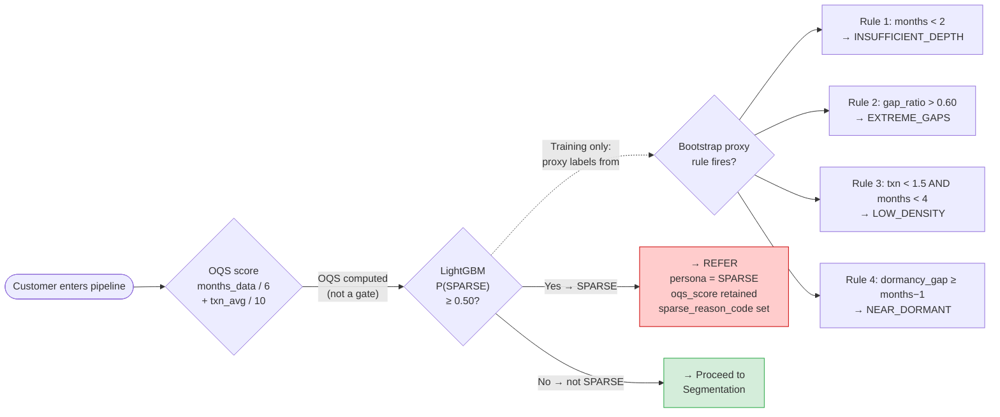
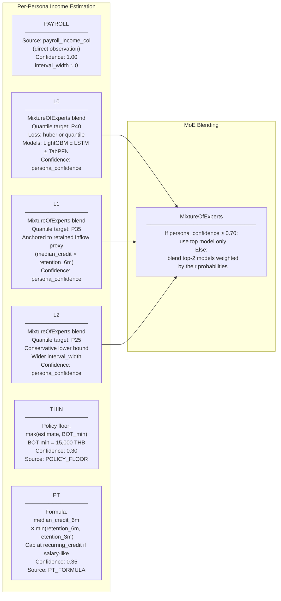
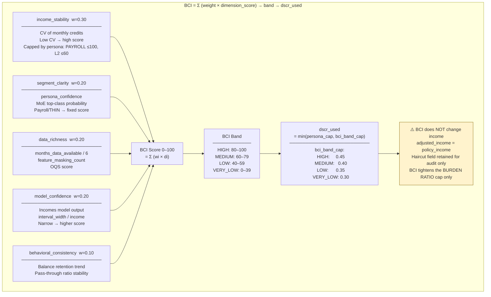
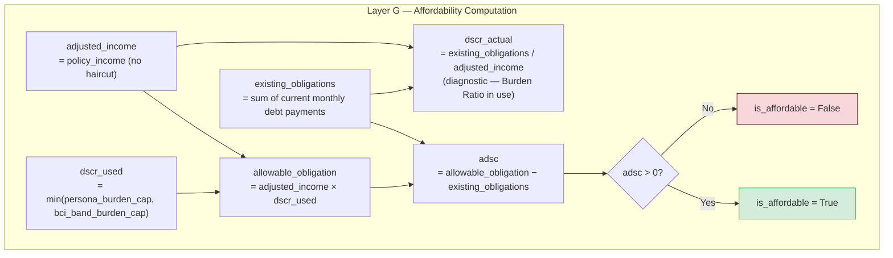
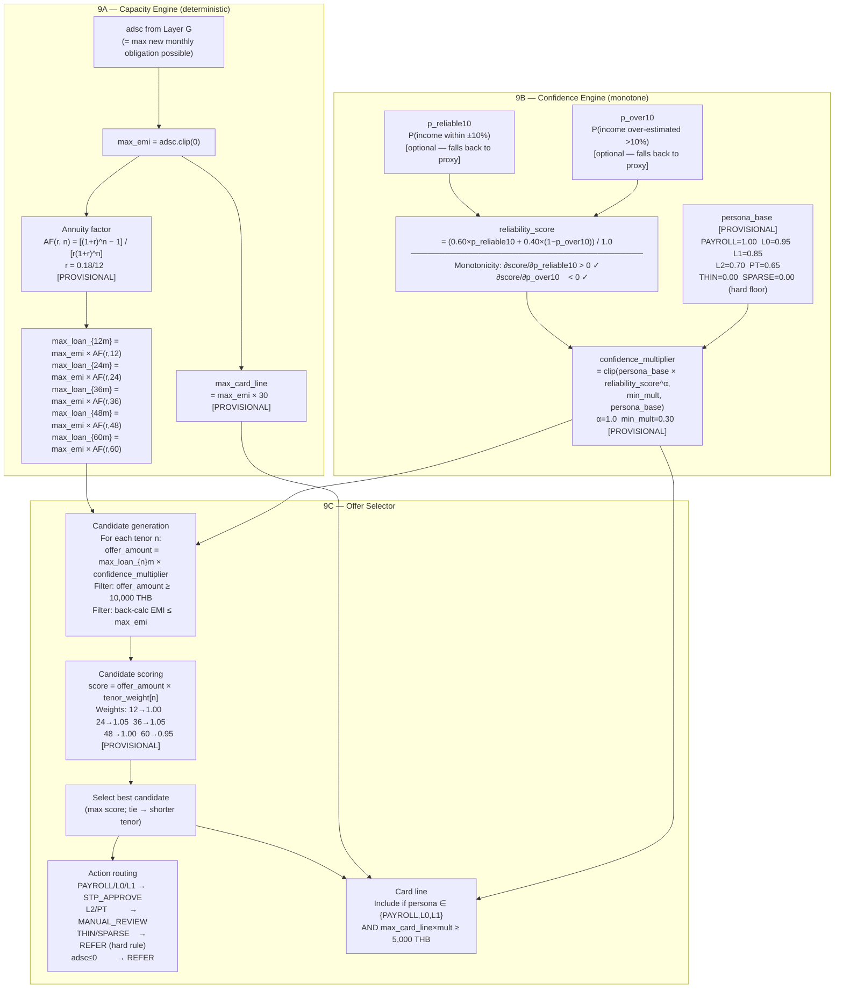

# Income Estimation & Affordability Framework — Visual Architecture
**CardX / SCB Group | v5.1 | GDZ Environment**

> **How to read this document**
> Functional descriptions appear in plain English. Technical details (class names, column names,
> formulas) follow in `monospace`. Every [PROVISIONAL] tag means the parameter needs
> calibration at 6-month vintage — treat it as an estimate, not a policy constant.

---

## 1. Full Pipeline at a Glance

```mermaid
flowchart TD
    RAW["📥 Raw Monthly Aggregate Data\n─────────────────────────────\nmonthly_agg DataFrame\nRows: customer × month\nup to 6 months of history"]

    FE["🔧 Step 1 · Feature Engineering\n─────────────────────────────\nFeatureEngineer.build_features()\n60+ behavioral features\n+ oqs_score  + feature_masking_count"]

    SC["🚦 Step 1.5 · SPARSE Gate\n─────────────────────────────\nSparseClassifier.predict_full()\nLightGBM + isotonic calibration\nBootstrap proxy labels"]

    SPARSE_OUT["📋 SPARSE Exit Record\n────────────────────\npersona = SPARSE\nfinal_decision = REFER\ndecision_reason = SPARSE_INSUFFICIENT_DATA\nbci_score = NaN  adsc = NaN\nprovisional_flags = [P-03, P-10]"]

    SEG["🏷️ Step 2 · Persona Segmentation\n─────────────────────────────\nSegmentationPipeline.run()\nPayroll detector → PAYROLL\nTHIN detector   → THIN\nRouter (LightGBM) → L0 / L1 / L2 / PT"]

    PSS["🔄 Step 3 · Persona Stability Smoother\n─────────────────────────────\nPersonaStabilitySmoother.smooth()\nEMA: smoothed = α·new + (1-α)·prev\nSwitch only if P(new) − P(current) > δ\nApplied to L0/L1/L2 only"]

    IE["💰 Step 4 · Income Estimation\n─────────────────────────────\nMixtureOfExperts.predict()\n─ PAYROLL → payroll_income_col (direct)\n─ L0/L1/L2 → ML model blend\n─ THIN     → policy_floor (BOT min)\n─ PT       → formula: median_credit × retention"]

    BCI["📊 Step 5 · BCI Scorer\n─────────────────────────────\nBCIScorer.compute()\nWeighted score 0–100 across 5 dimensions\nOutputs bci_band → tightens dscr_used\nDoes NOT modify PolicyIncome"]

    AFF["⚖️ Step 6 · Affordability Engine\n─────────────────────────────\nAffordabilityEngine.compute()\ndscr_used = min(persona_cap, bci_band_cap)\nallowable = adjusted_income × dscr_used\nadsc = allowable − existing_obligations"]

    POL["🏦 Step 7 · Policy Engine\n─────────────────────────────\nPolicyEngine.decide()\nMaps BCI band + affordability\n→ STP_APPROVE / STP_DECLINE\n   MANUAL_REVIEW / REFER"]

    MERGE["🔗 Step 8 · Merge\n─────────────────────────────\nSPARSE records ∪ non-SPARSE records\nReindex to preserve original order"]

    L9A["📐 Layer 9A · Capacity Engine\n─────────────────────────────\nCapacityEngine.compute()\nmax_emi = adsc.clip(0)\nmax_loan_{n}m = max_emi × annuity_factor\nmax_card_line = max_emi × 30"]

    L9B["🎚️ Layer 9B · Confidence Engine\n─────────────────────────────\nConfidenceEngine.compute()\nreliability_score from p_reliable10/p_over10\nconfidence_multiplier ∈ [0,1]\nTHIN/SPARSE → 0.0 hard floor"]

    L9C["🎯 Layer 9C · Offer Selector\n─────────────────────────────\nOfferSelector.select()\nGenerate candidates per tenor\nScore = offer × tenor_weight\nSelect best → action_code"]

    OUT["📤 Final Output\n─────────────────────────────\nActionOptimizationResult.combined\nAll v5.0 fields (frozen) +\nAll Layer 9 offer fields"]

    RAW --> FE
    FE --> SC
    SC -->|"is_sparse = True\n~5% of population"| SPARSE_OUT
    SC -->|"is_sparse = False\n~95% of population"| SEG
    SEG --> PSS
    PSS --> IE
    IE --> BCI
    BCI --> AFF
    AFF --> POL
    POL --> MERGE
    SPARSE_OUT --> MERGE
    MERGE --> L9A
    MERGE --> L9B
    L9A --> L9C
    L9B --> L9C
    L9C --> OUT

    style SPARSE_OUT fill:#ffcccc,stroke:#cc0000
    style SC fill:#fff3cd,stroke:#ffc107
    style OUT fill:#d4edda,stroke:#28a745
    style L9A fill:#cce5ff,stroke:#0066cc
    style L9B fill:#cce5ff,stroke:#0066cc
    style L9C fill:#cce5ff,stroke:#0066cc
```



---

## 2. SPARSE Routing — Decision Tree



---

## 3. Persona Assignment Logic

```mermaid
flowchart TD
    FEAT["Feature matrix (non-SPARSE customers)"]

    PAYROLL_DET{"Payroll detector\nhas_payroll_credit = 1\nmonths ≥ 3?"}
    THIN_DET{"THIN detector\nmonths < 6 OR\navg_txn < 5?"}
    ROUTER["LightGBM 2-stage router\nStage 1: Binary P(THIN)\nStage 2: Multiclass L0/L1/L2"]

    P["PAYROLL\nDirect income from payroll_income_col\nHighest BCI ceiling (100)\nDSCR cap: 0.40"]
    T["THIN\nPolicy floor: BOT min 15,000 THB\nBCI ceiling: 30\nDSCR cap: 0.35\nAlways REFER / MANUAL"]
    PT["PT (Pass-Through)\nFormula: median_credit × retention_robust\nBCI ceiling: 50\nDSCR cap: 0.35"]
    L0["L0 — Structured\nStable regular credits\nML income estimate P40\nBCI ceiling: 88\nDSCR cap: 0.40"]
    L1["L1 — Semi-formal\nRetained inflow proxy P35\nBCI ceiling: 75\nDSCR cap: 0.38"]
    L2["L2 — Informal/Volatile\nConservative P25 lower bound\nBCI ceiling: 60\nDSCR cap: 0.45 (relaxed — already conservative estimate)"]

    FEAT --> PAYROLL_DET
    PAYROLL_DET -->|Yes| P
    PAYROLL_DET -->|No| THIN_DET
    THIN_DET -->|Yes| T
    THIN_DET -->|No| ROUTER
    ROUTER -->|P(THIN)≥0.50| T
    ROUTER -->|L0 highest prob| L0
    ROUTER -->|L1 highest prob| L1
    ROUTER -->|L2 highest prob| L2
    ROUTER -->|PT pattern| PT

    style P fill:#d4edda,stroke:#28a745
    style T fill:#f8d7da,stroke:#721c24
    style L0 fill:#cce5ff,stroke:#004085
    style L1 fill:#d1ecf1,stroke:#0c5460
    style L2 fill:#fff3cd,stroke:#856404
    style PT fill:#e2d9f3,stroke:#4a235a
```

---

## 4. Income Estimation — Per-Persona Strategy



---

## 5. BCI Scorer — Component Breakdown



---

## 6. Affordability Engine — Formula Chain



---

## 7. Policy Engine — Decision Matrix

| BCI Band | is_affordable | Policy | final_decision |
|----------|--------------|--------|----------------|
| HIGH | True | STP | `STP_APPROVE` |
| HIGH | False | STP | `STP_DECLINE` |
| MEDIUM | True | STP | `STP_APPROVE` |
| MEDIUM | False | STP | `STP_DECLINE` |
| LOW | True | MANUAL_REVIEW | `MANUAL_REVIEW` |
| LOW | False | MANUAL_REVIEW | `REFER` |
| VERY_LOW | Any | DECLINE_OR_REFER | `REFER` |
| — | — | THIN / SPARSE | `REFER` |

---

## 8. Layer 9 — Offer Optimization Detail



---

## 9. Persona × Layer 9 Routing Summary

| Persona | 9B Base Mult | 9C Action | Verification | Card Line |
|---------|-------------|-----------|-------------|-----------|
| PAYROLL | 1.00 | STP_APPROVE | NONE | ✅ eligible |
| L0 | 0.95 | STP_APPROVE | LIGHT | ✅ eligible |
| L1 | 0.85 | STP_APPROVE | STANDARD | ✅ eligible |
| L2 | 0.70 | MANUAL_REVIEW | STANDARD | ❌ |
| PT | 0.65 | MANUAL_REVIEW | FULL | ❌ |
| THIN | **0.00** | **REFER** | FULL | ❌ |
| SPARSE | **0.00** | **REFER** | FULL | ❌ |

> STP_APPROVE downgrades to MANUAL_REVIEW if `max_emi < 1,000 THB` [PROVISIONAL]

---

## 10. Complete Data Schema — Evolution Through Pipeline

### After Step 1 — Feature Engineering
```
customer_id              index
months_data_available    int     observation depth
transaction_count_avg_monthly  float
months_with_zero_credit  int
dormancy_gap_max         int
credit_cv_6m             float   coefficient of variation
avg_eom_balance_3m       float
balance_volatility_6m    float
months_below_1000_balance int
pass_through_score       float
retention_ratio_6m       float
retention_ratio_3m       float
has_payroll_credit        int    0/1
median_credit_6m         float
avg_monthly_credit_6m    float
avg_recurring_credit_6m  float
fixed_amount_similarity  float
[40+ additional behavioral features]
oqs_score                float  0.50×min(months/6,1) + 0.50×min(txn/10,1)
feature_masking_count    int    0–6 (groups G1–G6 masked by months_available)
```

### After Step 1.5 — SPARSE Gate
```
is_sparse                bool
p_sparse                 float   calibrated probability
sparse_reason_code       str     INSUFFICIENT_DEPTH / EXTREME_GAPS /
                                 LOW_DENSITY / NEAR_DORMANT / MODEL_PREDICTED / None
oqs_score                float   (already in features)
feature_masking_count    int     (already in features)
```

### After Step 2–3 — Segmentation + Stability
```
persona                  str     PAYROLL / L0 / L1 / L2 / THIN / PT
persona_confidence       float   top-class probability from router
L0_prob                  float   smoothed (EMA)
L1_prob                  float   smoothed (EMA)
L2_prob                  float   smoothed (EMA)
```

### After Step 4 — Income Estimation
```
income_estimate          float   policy income (THB/month)
income_q25               float   lower uncertainty bound
income_q75               float   upper uncertainty bound
income_interval_width    float   income × (1−confidence) × 0.6
model_confidence         float   0–1
income_source            str     PAYROLL / ESTIMATED / POLICY_FLOOR / PT_FORMULA
```

### After Step 5 — BCI
```
bci_score                float   0–100
bci_band                 str     HIGH / MEDIUM / LOW / VERY_LOW
income_haircut           float   retained for audit only — NOT applied to income
adjusted_income          float   = policy_income (no haircut)
```

### After Step 6–7 — Affordability + Policy
```
existing_obligations     float   THB/month
allowable_obligation     float   adjusted_income × dscr_used
adsc                     float   allowable_obligation − existing_obligations
dscr_used                float   min(persona_cap, bci_band_cap)
dscr_actual              float   existing_obligations / adjusted_income
is_affordable            bool
final_decision           str     STP_APPROVE / STP_DECLINE / MANUAL_REVIEW / REFER
decision_reason          str     audit string
provisional_flags        list    [P-nn, ...] — active provisional items
```

### After Layer 9A — Capacity
```
max_obligation           float   adjusted_income × dscr_used  (echo)
residual_capacity        float   adsc  (echo)
max_emi                  float   max new monthly obligation
max_loan_12m             float   THB
max_loan_24m             float
max_loan_36m             float
max_loan_48m             float
max_loan_60m             float
max_card_line            float   THB
```

### After Layer 9B — Confidence
```
reliability_score        float   0–1
confidence_multiplier    float   0–1  (offer sizing — NOT income haircut)
confidence_reason_code   str     PRIMARY_RELIABILITY / FALLBACK_PROXY / ZERO_PERSONA_BASE
```

### After Layer 9C — Offer Selector (Final Record)
```
action_code              str     STP_APPROVE / MANUAL_REVIEW / REFER
verification_intensity   str     NONE / LIGHT / STANDARD / FULL
offer_amount_recommended float   THB  (= max_loan_{best_tenor} × confidence_multiplier)
recommended_tenor_months int     12 / 24 / 36 / 48 / 60 / 0
max_offerable_amount     float   THB  (pre-multiplier)
include_card_line        bool
card_line_recommended    float   THB
stp_flag                 bool
optimization_reason_codes list   audit trail
```

---

## 11. Key Formulas Reference

| Formula | Expression |
|---------|-----------|
| OQS score | `0.50 × min(months/6, 1) + 0.50 × min(avg_txn/10, 1)` |
| Persona stability | `p_smooth = α × p_new + (1−α) × p_prev`; switch if `ΔP > δ` |
| PT income | `median_credit_6m × min(retention_6m, retention_3m)` |
| Interval width | `income_estimate × (1 − model_confidence) × 0.60` |
| BCI score | `0.30×D1 + 0.20×D2 + 0.20×D3 + 0.20×D4 + 0.10×D5` |
| DSCR used | `min(persona_burden_cap, bci_band_burden_cap)` |
| ADSC | `adjusted_income × dscr_used − existing_obligations` |
| Annuity factor | `[(1+r)^n − 1] / [r × (1+r)^n]`  where `r = annual_rate/12` |
| Max loan | `max_emi × annuity_factor(r, n)` |
| Reliability score | `(0.60×p_reliable10 + 0.40×(1−p_over10)) / 1.0` |
| Confidence mult | `clip(persona_base × reliability_score^α, min_mult, persona_base)` |
| Candidate score | `offer_amount × tenor_preference_weight[n]` |
| Offer amount | `max_loan_{n}m × confidence_multiplier` |

---

## 12. Governance Guardrails

```
┌─────────────────────────────────────────────────────────────────────────┐
│  WHAT LAYER 9 MUST NEVER DO                                             │
├─────────────────────────────────────────────────────────────────────────┤
│  ✗  Modify policy_income, adjusted_income, dscr_used, adsc, bci_score  │
│  ✗  Override final_decision for THIN or SPARSE customers               │
│  ✗  Apply confidence_multiplier as an income haircut                   │
│  ✗  Use BCI in Layer 9B (already applied in Layer G)                   │
│  ✗  Make decisions without optimization_reason_codes (audit trail)     │
├─────────────────────────────────────────────────────────────────────────┤
│  WHAT LAYER 9 IS ALLOWED TO DO                                          │
├─────────────────────────────────────────────────────────────────────────┤
│  ✓  Read any field from frozen v5.0 final_output                       │
│  ✓  Add new fields to the output record                                │
│  ✓  Size the OFFER conservatively using confidence_multiplier          │
│  ✓  Route to REFER when capacity or confidence is insufficient         │
│  ✓  Include card line for eligible personas                            │
└─────────────────────────────────────────────────────────────────────────┘
```

---

## 13. Provisional Parameters — What Needs Calibration

| ID | Where | Parameter | Current Value | When to Calibrate |
|----|-------|-----------|--------------|-------------------|
| P-03 | SparseClassifier | `sparse_threshold` | 0.50 | 6M vintage with verified SPARSE outcomes |
| P-L9-01 | CapacityEngine | `reference_rate_annual` | 0.18 | Replace with product pricing |
| P-L9-02 | CapacityEngine | `card_line_months_equivalent` | 30 | Validate vs card utilisation data |
| P-L9-03 | ConfidenceEngine | `persona_base_multipliers` | L0=0.95, L1=0.85… | 6M cohort default rates |
| P-L9-04 | ConfidenceEngine | `reliability_weight_p_reliable` | 0.60 | Once p_reliable10 is wired |
| P-L9-05 | ConfidenceEngine | `reliability_alpha` | 1.0 | Tune conservatism slope |
| P-L9-06 | ConfidenceEngine | `min_multiplier` | 0.30 | 6M approval/collection outcome |
| P-L9-07 | OfferSelector | `min_loan_amount_thb` | 10,000 | Product minimum — confirm with business |
| P-L9-08 | OfferSelector | `stp_min_emi_thb` | 1,000 | Validate vs STP portfolio performance |
| P-L9-09 | OfferSelector | `tenor_preference_weights` | 24m/36m favoured | 6M revenue/risk calibration |

---

## 14. File Map

```
src/
├── income_estimation/
│   └── features.py            ← FeatureEngineer (Step 1)
├── segmentation/
│   ├── sparse_classifier.py   ← SparseClassifier (Step 1.5)
│   ├── pipeline.py            ← SegmentationPipeline (Step 2)
│   └── ...
├── modeling/
│   ├── label_engineering.py   ← LabelEngineer
│   ├── segment_trainer.py     ← SegmentModelTrainer
│   ├── mixture_of_experts.py  ← MixtureOfExperts (Step 4)
│   └── persona_stability.py   ← PersonaStabilitySmoother (Step 3)
├── bci/
│   └── scorer.py              ← BCIScorer (Step 5)
├── affordability/
│   ├── engine.py              ← AffordabilityEngine (Step 6)
│   └── policy.py              ← PolicyEngine (Step 7)
├── offer/
│   ├── capacity_engine.py     ← Layer 9A
│   ├── confidence_engine.py   ← Layer 9B
│   ├── offer_selector.py      ← Layer 9C
│   └── action_optimizer.py    ← Orchestrator
└── inference_pipeline.py      ← End-to-end orchestrator (Steps 1–8)

config/config.yaml             ← All parameters (PROVISIONAL tagged)
tests/
├── test_sparse_classifier.py  ← 36 tests
└── test_offer_optimizer.py    ← 53 tests
docs/architecture/
├── v5.0_frozen_architecture.md ← Layers A–G frozen spec
├── v5.1_architecture.md        ← Layer 9 additive spec
├── mental_model.md             ← Plain-English guide
└── visual_architecture.md      ← This document
```
